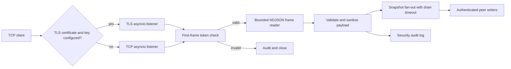
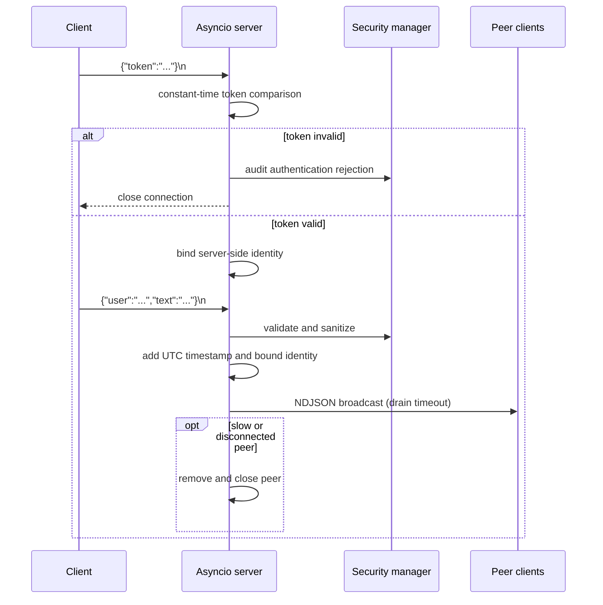

# TrojanChat

> A supported single-process Python asyncio broadcast server for newline-delimited JSON (NDJSON) chat messages. The server provides bounded framing, optional TLS, first-frame token authentication, input validation, audit logging, and backpressure-aware fan-out.

[](https://github.com/CoreyLeath-code/TrojanChat/releases/latest)
[](https://github.com/CoreyLeath-code/TrojanChat/actions/workflows/ci.yml)
[](https://github.com/CoreyLeath-code/TrojanChat/actions/workflows/security-supply-chain.yml)
[](https://github.com/CoreyLeath-code/TrojanChat/actions/workflows/benchmarks.yml)
[](LICENSE)
[](https://www.python.org/)
[](#wire-protocol)

## Scope and status

The supported deployable is [`server.py`](server.py): a process-local asyncio broadcast server. It is **not** a horizontally scaled chat service, durable message store, or an end-to-end production deployment. Files under [`experiments/`](experiments/) are unsupported work in progress and are outside the supported runtime and verification scope.

## Quick start

### Prerequisites

- Python 3.11 or later
- An `AUTH_TOKEN` value for the default authenticated mode
- Docker, optionally, to build the repository image

### Run locally

```bash
git clone https://github.com/CoreyLeath-code/TrojanChat.git
cd TrojanChat
python -m venv .venv
# Linux/macOS
source .venv/bin/activate
# PowerShell
# .venv\Scripts\Activate.ps1
python -m pip install --upgrade pip
python -m pip install -r requirements-dev.txt

# Required by default. Choose a strong value outside source control.
export AUTH_TOKEN='replace-me'
# PowerShell: $env:AUTH_TOKEN = 'replace-me'

python server.py
```

By default the server listens on `tcp://0.0.0.0:8888`. Configure `HOST`, `PORT`, `LOG_LEVEL`, `MAX_MESSAGE_BYTES` (default `65536`), and `DRAIN_TIMEOUT_S` (default `5`) through the environment. TLS is enabled only when both `TLS_CERT_FILE` and `TLS_KEY_FILE` are configured; otherwise the server logs that TLS is disabled.

## Wire protocol

Every message is one UTF-8 JSON object terminated by `\n`. With the default `REQUIRE_AUTH=true`, the first frame must contain the configured token:

```json
{"token":"replace-me"}
```

Subsequent client frames must include `user` and `text` fields, for example:

```json
{"user":"display-name","text":"hello"}
```

The server validates and sanitizes the payload, but does not trust the client-provided `user` value for broadcasts. Broadcast events use the server-bound identity (`AUTH_IDENTITY`, default `authenticated`) and include a UTC ISO-8601 timestamp. Malformed frames are audited and skipped; oversized frames, failed authentication, or slow/disconnected writers are disconnected.

## Architecture



### System design flow



## Reproducibility and verification

Run the supported checks from a clean checkout after installing `requirements-dev.txt`:

```bash
ruff check .
pytest -q
python -m benchmarks.run_benchmark --output benchmarks/latest.json
python -m pytest tests/test_benchmark.py -q
python -m json.tool benchmarks/latest.json
docker build -t trojanchat:local .
```

The CI workflow runs the test suite with coverage. The benchmark workflow reruns the storage microbenchmark, verifies that the generated throughput change is no worse than its predeclared `-15%` budget, and uploads `benchmarks/latest.json` and `benchmarks/benchmark_report.md` as artifacts. The security-and-supply-chain workflow runs secret scanning, filesystem and container scanning, and produces a CycloneDX SBOM artifact.

For comparable results, record the commit SHA, command, Python version, operating system, CPU/memory characteristics, benchmark parameters, and the generated JSON artifact. Do not compare host-to-host values as a regression result without matching those conditions.

## Research-style benchmark evidence

The committed artifact [`benchmarks/latest.json`](benchmarks/latest.json) records a **bounded in-process storage microbenchmark**, not network, TLS, JSON-serialization, Redis/database, multi-process, RSS, or production-SLO performance. It was generated on Windows 11 with Python 3.12.13 using seven iterations of 50,000 messages and a retention limit of 10,000.

| Measure | Legacy list baseline | Bounded synchronized store | Observed change |
|---|---:|---:|---:|
| Median latency per 50,000 writes | 1,155.519 ms | 1,239.880 ms | +7.3% |
| Throughput | 43,270.60 messages/s | 40,326.50 messages/s | -6.8% |
| Peak Python allocations | 21.205 MiB | 4.228 MiB | -80.06% |

**Method.** Each iteration inserts structurally identical messages; the benchmark uses `time.perf_counter` for elapsed time and `tracemalloc` for Python allocations. The comparison is useful only for the stated storage implementation and environment.

**Interpretation.** This artifact supports a lower-allocation bounded-retention trade-off within the declared throughput budget. It does not establish client capacity, end-to-end latency, security effectiveness, availability, or suitability for any safety-critical use.

## Operational considerations

- **Authentication:** enabled by default; the server rejects connections when `AUTH_TOKEN` is missing or incorrect. Set `REQUIRE_AUTH=false` only for explicitly controlled development use.
- **TLS:** optional at runtime, not automatic. Set both certificate environment variables before exposing the listener to untrusted networks.
- **Backpressure:** each peer write is bounded by `DRAIN_TIMEOUT_S`; timed-out or disconnected peers are dropped to prevent one client blocking a broadcast.
- **Scale:** connection and identity state are process-local. A cross-instance broker and explicit delivery semantics would be required before horizontal scaling.
- **Persistence:** messages are not durably stored by the supported server.

## Questions and answers

### Why use NDJSON rather than arbitrary socket reads?

NDJSON gives each message an explicit frame boundary. The server reads until a newline with a configured stream limit, allowing it to reject oversized frames instead of treating arbitrary chunk boundaries as messages.

### Does the client-selected `user` field determine the broadcast identity?

No. The field is still required by the current payload validator, but the server binds the broadcast identity after successful authentication and emits that server-side value in outgoing events.

### What happens when a peer is slow or disconnects during a broadcast?

The server fans out over a snapshot of active writers. Each `drain()` call has a timeout; connection failures and timeouts remove and close only the affected peer while the remaining fan-out continues.

### Is TLS required?

No. It is opt-in through `TLS_CERT_FILE` and `TLS_KEY_FILE`. A startup warning makes the plaintext mode visible; deployers are responsible for enabling TLS where the threat model requires it.

### Do the benchmark numbers prove real-world chat performance?

No. They measure only the documented in-process storage experiment. Reproduce the benchmark and publish a separate, versioned end-to-end experiment before making network or capacity claims.

## License

This project is available under the [MIT License](LICENSE).
